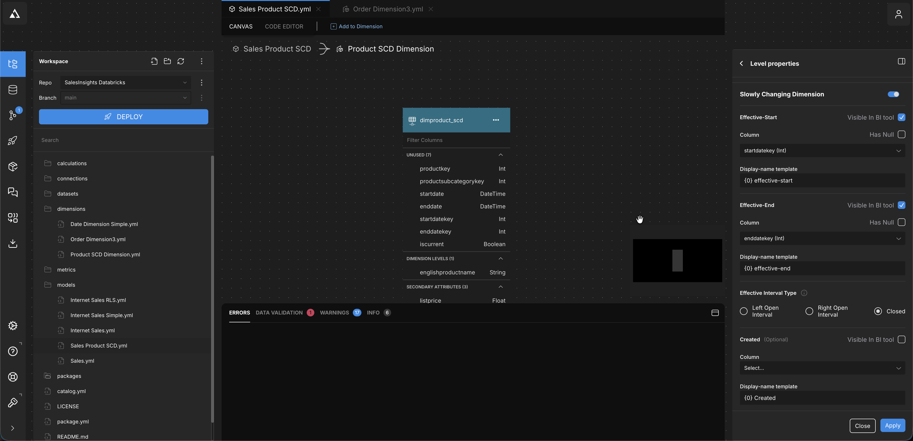
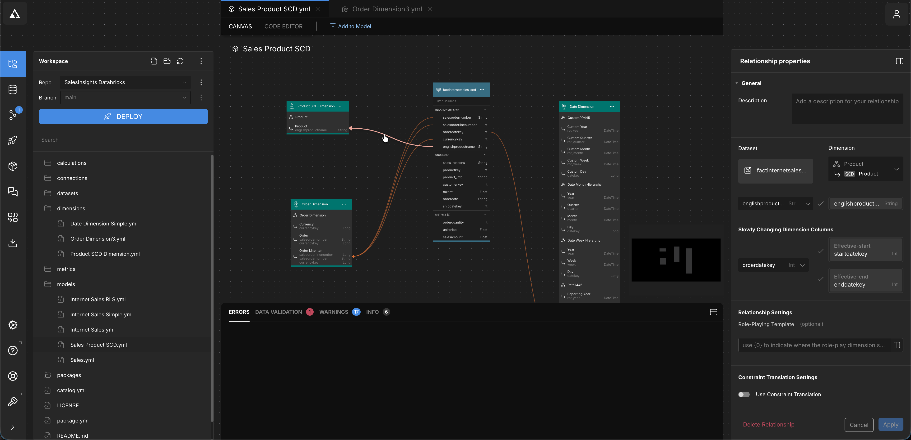

# Slowly Changing Dimension (Type 2) demo

This repo contains a worked example of AtScale's slowly changing dimension
(SCD) feature, using a Type 2 product dimension on the AdventureWorks data in
Databricks (`hive_metastore.as_adventure`).

A Type 2 dimension keeps one row per *version* of a business entity. When an
attribute such as the list price changes, the old row is closed and a new row
is added. Facts are then matched to the version that was valid **on the date of
the fact**, so history is never rewritten.

Background: [Kimball design tip 152](https://www.kimballgroup.com/2013/02/design-tip-152-slowly-changing-dimension-types-0-4-5-6-7/),
[AtScale SCD docs](https://documentation.atscale.com/container/creating-and-sharing-cubes/creating-cubes/modeling-cube-dimensions/edit-dimensions-in-a-cube/scd#slowly-changing-dimensions).

## What is in the repo

| Object | File | Purpose |
|---|---|---|
| Model | `models/Sales Product SCD.yml` | Copy of `Sales` using the SCD product dimension and SCD-aware metrics |
| Dimension | `dimensions/Product SCD Dimension.yml` | Type 2 product dimension (`scd_properties` on the `product_scd` level) |
| Dataset | `datasets/dimproduct_scd.yml` | Versioned product table |
| Dataset | `datasets/factinternetsales_scd.yml` | Sales fact with the product business key added |
| Dimension | `dimensions/Order Dimension SCD.yml` | Order dimension keyed on order and line only |
| Dataset | `datasets/dimorder_scd.yml` | Cleaned order table |
| Metrics | `metrics/salesamount_scd.yml`, `orderquantity_scd.yml`, `lastproductunitprice_scd.yml` | Copies of the existing metrics, pointing at `factinternetsales_scd` |
| Excel demo | `docs/SCD Product Demo.xlsx` | Live PivotTable on the model over XMLA |

The three `(SCD)` metrics are the only ones tied to the SCD fact. The other
metrics in the model still point at `factinternetsales` and do not slice by the
SCD product dimension.

## Databricks tables

All created in `hive_metastore.as_adventure`; the original tables are untouched.

| Table | Built from | Rows |
|---|---|---|
| `dimproduct_scd` | `dimproduct` | 606 versions of 504 products |
| `factinternetsales_scd` | `factinternetsales` plus `englishproductname` from `dimproduct` | 60,398 |
| `dimorder_scd` | `se_library.as_adventure_se_demo2.dimorder` | 60,398 |

### 1. `dimproduct_scd`: versioned product dimension

The original `dimproduct` has one row per product version and a single
`startdate` (a string), but no end date and no flag for the current row.
Example, `Mountain-200 Black, 46`:

| productkey | englishproductname | listprice | startdate |
|---|---|---|---|
| 362 | Mountain-200 Black, 46 | 2049.0981 | 2006-07-01 |
| 363 | Mountain-200 Black, 46 | 2294.99 | 2007-07-01 |

`dimproduct_scd` adds typed dates, an end date derived with
`lead(startdate) over (partition by englishproductname order by startdate)`,
integer date keys, and a current flag:

| productkey | listprice | startdate | enddate | startdatekey | enddatekey | iscurrent |
|---|---|---|---|---|---|---|
| 362 | 2049.0981 | 2006-07-01 | 2007-06-30 | 20060701 | 20070630 | false |
| 363 | 2294.99 | 2007-07-01 | 9999-12-31 | 20070701 | 99991231 | true |

Rules used to build it:

- **Business key** is `englishproductname`. `productkey` is the version-specific surrogate key.
- **End date** is the day *before* the next version starts, so the interval is
  **closed** (both ends inclusive) and versions never overlap. The current
  version ends on `9999-12-31`.
- **Integer date keys** (`yyyyMMdd`) are used for the SCD columns because the fact
  joins on `orderdatekey`, which is an int. All SCD columns must share a data
  type.
- Of the 504 products, 28 have sales in more than one version; the others have a
  single sold version.

### 2. `factinternetsales_scd`: fact with a business key

The original fact only carries the version-specific `productkey` (362 or 363
above), which already points at one fixed version. To let AtScale choose the
version by date, the fact needs the **business key**, so
`factinternetsales_scd` is `factinternetsales` plus `englishproductname`.
Every one of the 60,398 rows gets a product name and falls into exactly one
version.

Orders around the version boundary for `Mountain-200 Black, 46`:

| salesordernumber | orderdatekey | productkey in fact | unitprice | salesamount | version AtScale picks |
|---|---|---|---|---|---|
| SO51074 | 20070630 | 362 | 2049.10 | 2049.10 | 2006-07-01 (price 2049.0981) |
| SO51194 | 20070702 | 363 | 2294.99 | 2294.99 | 2007-07-01 (price 2294.99) |
| SO51193 | 20070702 | 363 | 2294.99 | 2294.99 | 2007-07-01 (price 2294.99) |

## How the SML works

### Dimension: `scd_properties`

On the `product_scd` level of `Product SCD Dimension`:

```yaml
level_attributes:
  - unique_name: product_scd
    dataset: dimproduct_scd
    key_columns: [englishproductname]      # business key
    name_column: englishproductname
    scd_properties:
      effective_interval_type: closed       # both start and end are inclusive
      effective_start: { column: startdatekey, display_name_template: '{0} effective-start', has_null_values: false, visible: true }
      effective_end:   { column: enddatekey,   display_name_template: '{0} effective-end',   has_null_values: false, visible: true }
      as_of_date:      { display_name_template: '{0} As-Of-Date' }
      is_latest:       { display_name_template: '{0} Is Latest' }
      join_on_fact_effective_key: { display_name_template: '{0} Join-On-Fact-Effective-Key' }
```

Constraints enforced by the SML validator:

- SCD columns must be simple columns of an int, bigint, long, date, datetime or timestamp type, and all of the same type.
- Start and end columns must be different columns.
- Only one level per hierarchy can carry SCD settings.
- `scd_properties` requires SML 1.6 features. This repo's `catalog.yml` says
  `version: 1.5` and it validated and deployed without a change.
- The engine rejects `timestamp` as a column type. Use `datetime` for
  timestamp columns in datasets.

### Model: `scd_column`

The relationship from the fact to the dimension names the fact's date column:

```yaml
- unique_name: factinternetsales_Product_Dimension
  from:
    dataset: factinternetsales_scd
    join_columns: [englishproductname]   # business key on the fact
    scd_column: orderdatekey             # fact date used to pick the version
  to:
    dimension: Product SCD Dimension
    level: product_scd
```

For each fact row the engine finds the dimension row with the same business
key whose `[effective_start, effective_end]` contains `orderdatekey`.

## Configuring it in the AtScale Design Center

The same settings can be made in the Design Center. SCD has two parts: the
**level properties** on the dimension and the **relationship properties** on the
model. Reference documentation:
[Slowly changing dimensions](https://documentation.atscale.com/container/creating-and-sharing-cubes/creating-cubes/modeling-cube-dimensions/edit-dimensions-in-a-cube/scd#slowly-changing-dimensions).

### 1. Dimension level properties

Open `Product SCD Dimension`, select the `product_scd` level (key
`englishproductname`) and turn on **Slowly Changing Dimension**.



| Setting | Value here | Meaning |
|---|---|---|
| Effective-Start, Column | `startdatekey` (Int) | First day the version is valid |
| Effective-End, Column | `enddatekey` (Int) | Last day the version is valid |
| Has Null | off for both | Neither column contains nulls; the current version ends on `99991231` instead |
| Visible In BI tool | on for both | Shows the start and end as attributes, which is handy in a demo |
| Display-name template | `{0} effective-start`, `{0} effective-end` | `{0}` is replaced by the level name, giving `product_scd effective-start` |
| Effective Interval Type | **Closed** | Both start and end are inclusive. Left Open and Right Open treat one end as exclusive |
| Created (optional) | not set | Optional column for when the row was created, with its own template |

The start and end columns must be simple columns of the same date or integer
type. The dataset's other columns (`productkey`, `startdate`, `enddate`,
`iscurrent`) are unused by the SCD settings. In the canvas they appear under
"Unused", and only `englishproductname` is the dimension level.

The Interval Type must match how the table was built. With **Closed**, an end
date must be the day before the next start. With Right Open, the end date would
be the next start date, and orders on the boundary day belong to the newer
version.

### 2. Relationship properties

In the model, select the relationship between `factinternetsales_scd` and
`Product SCD Dimension`. The dimension is tagged **SCD** in the canvas.



| Setting | Value here | Meaning |
|---|---|---|
| Dataset | `factinternetsales_scd` | The fact the relationship starts from |
| Dimension / level | Product SCD Dimension, Product | The target level (`product_scd`) |
| Join columns | `englishproductname` to `englishproductname` | The business key on both sides. Joining on the surrogate `productkey` would pin each fact row to one fixed version |
| Slowly Changing Dimension Columns, fact column | `orderdatekey` (Int) | The fact date compared against the version's effective dates (`scd_column` in SML) |
| Effective-start / Effective-end | `startdatekey`, `enddatekey` | Read-only; they come from the level properties |
| Role-Playing Template | empty | Not role-played here |
| Use Constraint Translation | off | Not needed |

For each fact row, AtScale looks up the dimension row with the same
`englishproductname` where `orderdatekey` falls inside the effective start and
end, and returns that version's attributes (list price, line, subcategory).

The Design Center writes the same SML described above, so edits made in the
UI and in the YAML files stay in sync.

## What it looks like in a query

`Mountain-200 Black, 46` by version, from the Databricks tables:

| Version valid from | Valid to | List price | First order | Last order | Order lines | Units | Sales |
|---|---|---|---|---|---|---|---|
| 2006-07-01 | 2007-06-30 | 2049.0981 | 2006-07-01 | 2007-06-30 | 201 | 334 | 684,399.42 |
| 2007-07-01 | 9999-12-31 | 2294.99 | 2007-07-01 | 2008-06-29 | 419 | 678 | 1,556,003.22 |

Other products with two sold versions: Mountain-200 Black 42, Mountain-200
Silver 38, Road-250 Black 52, Road-250 Red 58, Road-550-W Yellow 42.

The `Sport-100 Helmet` products have three versions (2005-07-01, 2006-07-01 and
2007-07-01), but in this data only the latest sold, for example Black helmet:
118,056.26 in sales and 3,374 units, all on the 2007-07-01 version. That makes
them a weaker demo than the Mountain-200 bikes.

### Attributes exposed to BI tools

On the product level the model exposes `product_scd`, `product_scd_list_price`,
`product_scd_line`, `product_scd_subcategory`, `levelScdEffectiveStart_product_scd`,
`levelScdEffectiveEnd_product_scd`, `product_scd As-Of-Date`,
`product_scd Is Latest` and `product_scd Join-On-Fact-Effective-Key`.

## Excel demo

1. Data, Get Data, From Database, From Analysis Services. Use the XMLA endpoint of
   dev.atscale-se-demo.com and choose catalog `Sales Insights - Databricks`, cube
   `Sales Product SCD`.
2. Filter Product to `Mountain-200 Black, 46`.
3. Put Product, List Price and the effective-start and effective-end attributes
   in rows, and Sales Amount (SCD) as the value. Expect the two rows from the
   table above.
4. Optionally add order attributes from the Order Dimension SCD.

`SCD Product Demo.xlsx` holds such a pivot (Sport-100 Helmets).
